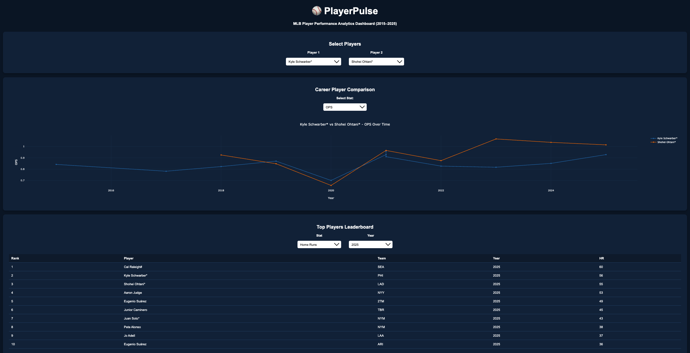
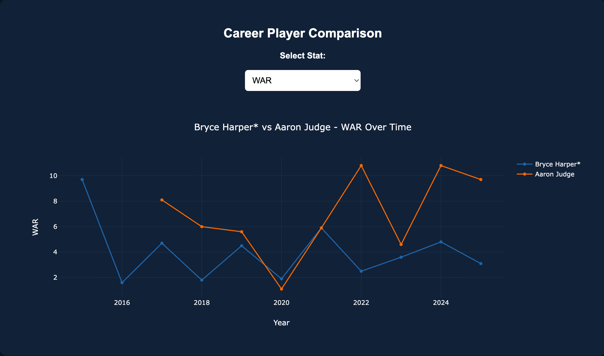
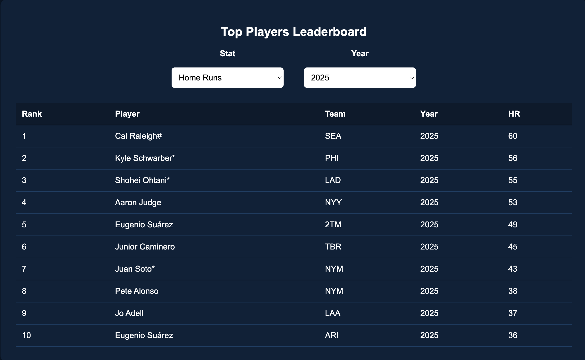

# ⚾ PlayerPulse



**MLB Player Performance Analytics Dashboard (2015–2025)**

PlayerPulse is a full-stack sports analytics dashboard that allows users to explore and compare MLB player performance across multiple seasons. The application provides interactive charts, dynamic stat switching, and leaderboard analytics using historical MLB batting data.

This project demonstrates how modern analytics tools combine **backend APIs, data processing, and interactive visualizations** to analyze player performance trends.

---

# 🚀 Features

### Player Comparison

Select two MLB players and compare their performance across multiple seasons.

### Dynamic Stat Switching

Instantly switch between key player statistics:

* OPS
* Home Runs
* RBI
* WAR
* Batting Average

The chart updates automatically when the statistic changes.

### Leaderboard Analytics

View the top performing players for a selected stat and season.

### Multi-Season Dataset

Analyze MLB player performance from **2015–2025**.

### Interactive Visualization

Charts are rendered dynamically using Plotly, allowing users to visually compare player trends over time.

---

# 🧰 Tech Stack

## Backend

* Python
* FastAPI
* Pandas

## Frontend

* HTML
* CSS
* JavaScript
* Plotly

## Data Sources

MLB batting datasets sourced from:

* Baseball Reference
* Kaggle MLB datasets

---

# 📂 Project Structure

```
PlayerPulse
│
├── backend
│   └── main.py
│
├── frontend
│   └── index.html
│
├── data
│   ├── mlb_players.csv
│   └── mlb_2025_players.csv
│
├── screenshots
│   ├── dashboard-overview.png
│   ├── player-comparison.png
│   └── leaderboard-view.png
│
├── requirements.txt
└── README.md
```

---

# 📊 Dashboard Screenshots

## Full Dashboard


The full dashboard allows users to select players, visualize career statistics, and view season leaderboards.

---

## Player Comparison Chart



This chart compares two players across seasons using advanced baseball statistics such as **WAR, OPS, HR, RBI, and Batting Average**.

Users can switch between stats to analyze player performance trends.

---

## Leaderboard Analytics



The leaderboard shows the **top MLB players for a selected statistic and year**, allowing users to explore top performers across seasons.

---

# ⚙️ API Endpoints

### Get all players

```
GET /players
```

Returns a list of all players available in the dataset.

---

### Get player statistics

```
GET /player/{player_name}
```

Returns historical statistics for a specific player.

---

### Compare two players

```
GET /compare?player1=PLAYER_A&player2=PLAYER_B
```

Returns season-by-season statistics for both players.

---

### Get leaderboard

```
GET /top?stat=HR&year=2025&limit=10
```

Returns the top players for a specific statistic and season.

---

# 🖥 Running the Project Locally

### 1. Clone the repository

```
git clone https://github.com/YOUR_USERNAME/playerpulse.git
cd playerpulse
```

---

### 2. Install dependencies

```
pip3 install -r requirements.txt
```

---

### 3. Start the backend server

```
uvicorn backend.main:app --reload
```

---

### 4. Open the dashboard

Open the frontend file in your browser:

```
frontend/index.html
```

---

# 🎯 Project Purpose

This project demonstrates how software engineering and data analytics can be combined to build an interactive sports analytics tool.

The dashboard mimics the types of internal analytics tools used by professional sports organizations to analyze player performance and compare statistics across seasons.

---

# 🔮 Future Improvements

Possible future enhancements include:

* Player stat summary cards
* Team-level analytics
* Pitching statistics
* Live MLB data integration
* Cloud deployment
